# Orchideo - Deployment Documentation

**Centrální dokumentace pro nasazení Orchideo do production i development prostředí**

**Vytvořeno:** 2026-01-31
**Platné pro:** Orchideo v0.1.0+

---

## 📚 Dokumentace Index

Deployment dokumentace je rozdělena do několika souborů podle účelu:

| Dokument                                                          | Účel                                        | Kdy použít                                |
| ----------------------------------------------------------------- | ------------------------------------------- | ----------------------------------------- |
| **[PRODUCTION-DEPLOYMENT.md](./guides/PRODUCTION-DEPLOYMENT.md)** | Kompletní průvodce pro production nasazení  | Při prvním deploymenty nebo major změnách |
| **[DEPLOYMENT-CHECKLIST.md](./guides/DEPLOYMENT-CHECKLIST.md)**   | Checklist pro každý deployment              | Před KAŽDÝM production deploymentem       |
| **[VPS-vs-PRODUCTION.md](./guides/VPS-vs-PRODUCTION.md)**         | Srovnání development a production prostředí | Pro pochopení rozdílů mezi prostředími    |
| **[ENV-UPDATE-SUMMARY.md](../tmp/ENV-UPDATE-SUMMARY.md)**         | Historie změn VPS environment               | Reference pro VPS dev setup               |

---

## 🚀 Quick Start

### Pro VPS Development (již nasazeno)

```bash
cd /home/app/projects/orchideo

# Restart aplikace
docker compose --env-file .env.vps -f docker-compose.vps.yml restart app

# Sledovat logy
docker compose --env-file .env.vps -f docker-compose.vps.yml logs -f app
```

**URL:** https://orchideo.ppsys.eu
**Status:** ✅ Running

---

### Pro Production (nový deployment)

**1. Připravit environment:**

```bash
cd /opt/orchideo  # nebo váš production path
cp .env.production.template .env.production
nano .env.production  # vyplnit všechny CHANGE_ME hodnoty
```

**2. Spustit deployment script:**

```bash
./scripts/deploy-production.sh
```

**3. Ověřit deployment:**

```bash
curl -I https://app.orchideo.ppsys.eu
# Expected: HTTP/2 200
```

**Detaily:** Viz [PRODUCTION-DEPLOYMENT.md](./guides/PRODUCTION-DEPLOYMENT.md)

---

## 📁 Soubory & Struktura

### Environment Files

| Soubor                     | Prostředí           | Status       | Commited?          |
| -------------------------- | ------------------- | ------------ | ------------------ |
| `.env.example`             | Template            | ✅ Kompletní | ✅ Yes             |
| `.env.production.template` | Production template | ✅ Kompletní | ✅ Yes             |
| `.env.vps`                 | VPS Development     | ✅ Aktivní   | ❌ No (gitignored) |
| `.env.production`          | Production          | ⚠️ Vytvořit  | ❌ No (gitignored) |

### Docker Compose Files

| Soubor                    | Prostředí  | Účel                                  |
| ------------------------- | ---------- | ------------------------------------- |
| `docker-compose.yml`      | Base       | Základní konfigurace (ne pro použití) |
| `docker-compose.vps.yml`  | VPS Dev    | Development s hot reload              |
| `docker-compose.prod.yml` | Production | Production build s optimalizacemi     |

### Dockerfiles

| Soubor           | Účel                         |
| ---------------- | ---------------------------- |
| `Dockerfile`     | Production multi-stage build |
| `Dockerfile.dev` | Development s hot reload     |

### Scripts

| Script                         | Účel                                 | Kdy použít                 |
| ------------------------------ | ------------------------------------ | -------------------------- |
| `scripts/deploy-production.sh` | Automatizovaný production deployment | Production deployment      |
| `scripts/backup-database.sh`   | Database backup                      | Manuálně nebo přes crontab |
| `tmp/verify-env.sh`            | Environment validace                 | Po změnách .env            |

---

## 🔑 Klíčové Environment Variables

### MUSÍ být ODLIŠNÉ mezi Dev a Prod

```env
# Development
NODE_ENV=development
NEXTAUTH_SECRET=<DEV_SECRET>
POSTGRES_PASSWORD=<DEV_PASSWORD>
LOG_LEVEL=debug
STORAGE_TYPE=local

# Production
NODE_ENV=production
NEXTAUTH_SECRET=<PROD_SECRET>
POSTGRES_PASSWORD=<PROD_PASSWORD>
LOG_LEVEL=info
STORAGE_TYPE=r2
```

### MUSÍ být STEJNÉ mezi Dev a Prod

```env
# CRITICAL: Must be identical!
ENCRYPTION_KEY="9NV0ifaDaw1ZobhavkvXDXE7t4MnOp7/gdAUzApkkJk="

# Facebook credentials
FACEBOOK_APP_ID="1605455470467424"
FACEBOOK_APP_SECRET="9651f82bfc6d439209d856fffe6e1ee0"
FACEBOOK_CONFIG_ID="655031237668794"

# Email
POSTMARK_API_TOKEN="c82f2544-e919-4657-b9c8-5481869172c9"
POSTMARK_FROM_EMAIL="noreply@invix.cz"

# Business logic
MAX_FEED_POSTS=300
MAX_FEED_PAGES=5
REPORT_EXPIRATION_DAYS=30
```

**⚠️ DŮLEŽITÉ:** `ENCRYPTION_KEY` NIKDY neměňte po prvním deployment! Změna invaliduje všechny šifrované Facebook tokeny v databázi.

**Detaily:** Viz [VPS-vs-PRODUCTION.md](./guides/VPS-vs-PRODUCTION.md)

---

## 🌍 Prostředí

### VPS Development

**URL:** https://orchideo.ppsys.eu
**Server:** ppsys.eu VPS
**Purpose:** Development & testing s production daty
**Status:** ✅ Running

**Charakteristiky:**

- Hot reload enabled
- Debug logging
- Local storage
- Docker PostgreSQL
- X-Robots-Tag: noindex

**Management:**

```bash
cd /home/app/projects/orchideo

# Restart
docker compose --env-file .env.vps -f docker-compose.vps.yml restart app

# Logs
docker compose --env-file .env.vps -f docker-compose.vps.yml logs -f app

# Database
docker exec orchideo-postgres psql -U orchideo -d orchideo
```

---

### Production

**URL:** https://app.orchideo.ppsys.eu (nebo custom domain)
**Server:** TBD (může být stejný VPS nebo dedikovaný)
**Purpose:** Public production environment
**Status:** ⚠️ Připravit

**Charakteristiky:**

- Production build
- Info/warn logging
- Cloudflare R2 storage
- Managed PostgreSQL (doporučeno)
- Health checks enabled

**Management:**

```bash
cd /opt/orchideo

# Deploy
./scripts/deploy-production.sh

# Logs
docker compose --env-file .env.production -f docker-compose.prod.yml logs -f app

# Database backup
./scripts/backup-database.sh
```

---

## 🔄 Deployment Workflow

### VPS Development (Continuous)


**Příkazy:**

```bash
# Local
git checkout stage
git commit -m "feat: new feature"
git push origin stage

# VPS (automaticky přes hot reload)
# Změny se projeví automaticky
```

---

### Production (Scheduled Releases)

```mermaid
graph TD
    A[Merge stage → main] --> B[Tag release]
    B --> C[Run checklist]
    C --> D[Backup database]
    D --> E[Deploy script]
    E --> F[Run migrations]
    F --> G[Start containers]
    G --> H[Smoke tests]
    H --> I{Success?}
    I -->|Yes| J[Monitor]
    I -->|No| K[Rollback]
```



**Příkazy:**

```bash
# 1. Prepare release
git checkout main
git pull origin main
git merge stage
git tag v1.2.3
git push origin main --tags

# 2. Deploy
cd /opt/orchideo
./scripts/deploy-production.sh

# 3. Verify
curl -I https://app.orchideo.ppsys.eu
# Open browser: https://app.orchideo.ppsys.eu
# Run through DEPLOYMENT-CHECKLIST.md

# 4. Monitor
docker compose --env-file .env.production -f docker-compose.prod.yml logs -f app
```

---

## 🛠️ Běžné Úkoly

### Změna Environment Variable

**VPS Dev:**

```bash
cd /home/app/projects/orchideo
nano .env.vps
# Edit variable
docker compose --env-file .env.vps -f docker-compose.vps.yml restart app
```

**Production:**

```bash
cd /opt/orchideo
nano .env.production
# Edit variable
docker compose --env-file .env.production -f docker-compose.prod.yml down
docker compose --env-file .env.production -f docker-compose.prod.yml up -d
```

---

### Database Migration

**VPS Dev:**

```bash
cd /home/app/projects/orchideo

# Generate migration
npm run db:migrate

# Apply to VPS dev
docker exec orchideo-app npm run db:push
```

**Production:**

```bash
cd /opt/orchideo

# Backup first!
./scripts/backup-database.sh

# Deploy migration
docker compose --env-file .env.production -f docker-compose.prod.yml run --rm app npx prisma migrate deploy
```

---

### Database Backup & Restore

**Backup:**

```bash
./scripts/backup-database.sh

# Custom retention
./scripts/backup-database.sh --retention 7

# VPS dev container
./scripts/backup-database.sh --container orchideo-postgres
```

**Restore:**

```bash
# List backups
ls -lht /opt/orchideo/backups/

# Restore specific backup
gunzip -c /opt/orchideo/backups/orchideo_20260131_020000.sql.gz | \
  docker exec -i orchideo-postgres-prod psql -U orchideo -d orchideo
```

---

### View Logs

**Real-time:**

```bash
# VPS Dev
docker compose --env-file .env.vps -f docker-compose.vps.yml logs -f app

# Production
docker compose --env-file .env.production -f docker-compose.prod.yml logs -f app
```

**Last N lines:**

```bash
# Last 100 lines
docker compose --env-file .env.vps -f docker-compose.vps.yml logs app --tail 100

# Filter by level (error only)
docker compose --env-file .env.vps -f docker-compose.vps.yml logs app | grep -i error
```

---

### Check Container Health

```bash
# Status
docker compose --env-file .env.production -f docker-compose.prod.yml ps

# Health check
curl https://app.orchideo.ppsys.eu/api/health

# Resource usage
docker stats orchideo-app-prod orchideo-postgres-prod
```

---

## 🚨 Troubleshooting

### Problem: Environment Variable Not Set

**Symptom:**

```
Error: FACEBOOK_APP_SECRET is not set
```

**Diagnosis:**

```bash
# Check in container
docker exec orchideo-app-prod env | grep FACEBOOK

# Check in .env file
grep FACEBOOK .env.production
```

**Fix:**

```bash
# Add to .env.production
echo 'FACEBOOK_APP_SECRET="your_secret_here"' >> .env.production

# Restart
docker compose --env-file .env.production -f docker-compose.prod.yml restart app
```

---

### Problem: Database Connection Failed

**Symptom:**

```
Error: P1001: Can't reach database server
```

**Diagnosis:**

```bash
# Check PostgreSQL container
docker compose --env-file .env.production -f docker-compose.prod.yml ps postgres

# Check DATABASE_URL
grep DATABASE_URL .env.production
```

**Fix:**

```bash
# Verify PostgreSQL is running
docker compose --env-file .env.production -f docker-compose.prod.yml up -d postgres

# Test connection
docker exec orchideo-postgres-prod psql -U orchideo -d orchideo -c "SELECT 1;"
```

---

### Problem: Prisma Client Missing

**Symptom:**

```
Error: Cannot find module '@prisma/client'
```

**Fix:**

```bash
# Generate Prisma client
docker compose --env-file .env.production -f docker-compose.prod.yml run --rm app npm run db:generate

# Restart
docker compose --env-file .env.production -f docker-compose.prod.yml restart app
```

---

## 📞 Support & Contacts

**Documentation:**

- Main docs: `/docs/`
- Deployment: `/docs/guides/PRODUCTION-DEPLOYMENT.md`
- Checklist: `/docs/guides/DEPLOYMENT-CHECKLIST.md`

**Scripts:**

- Deploy: `./scripts/deploy-production.sh --help`
- Backup: `./scripts/backup-database.sh --help`

**Emergency Rollback:**

```bash
# Stop current version
docker compose --env-file .env.production -f docker-compose.prod.yml down

# Restore from backup
gunzip -c /opt/orchideo/backups/orchideo_<timestamp>.sql.gz | \
  docker exec -i orchideo-postgres-prod psql -U orchideo -d orchideo

# Deploy previous version
git checkout v1.2.2
./scripts/deploy-production.sh
```

---

## ✅ Checklist před Production Deployment

Před každým production deploymentem projděte:

1. [ ] Přečíst [DEPLOYMENT-CHECKLIST.md](./guides/DEPLOYMENT-CHECKLIST.md)
2. [ ] Ověřit `.env.production` je kompletní
3. [ ] Spustit `grep CHANGE_ME .env.production` (očekáváno: žádný výstup)
4. [ ] Backup databáze: `./scripts/backup-database.sh`
5. [ ] Test build lokálně: `npm run build`
6. [ ] Deploy: `./scripts/deploy-production.sh`
7. [ ] Smoke tests: Login → Page select → Analysis → Report
8. [ ] Monitor logy: `docker logs -f orchideo-app-prod`

---

**Last Updated:** 2026-01-31
**Version:** 1.0
**Maintained by:** INVIX s.r.o.

---

## 📖 Další Dokumentace

- [Architecture](./ARCHITECTURE.md) - Architektura aplikace
- [Tech Context](./tech-context.md) - Technický kontext
- [Facebook Integration](./integrations/facebook.md) - Facebook API integrace
